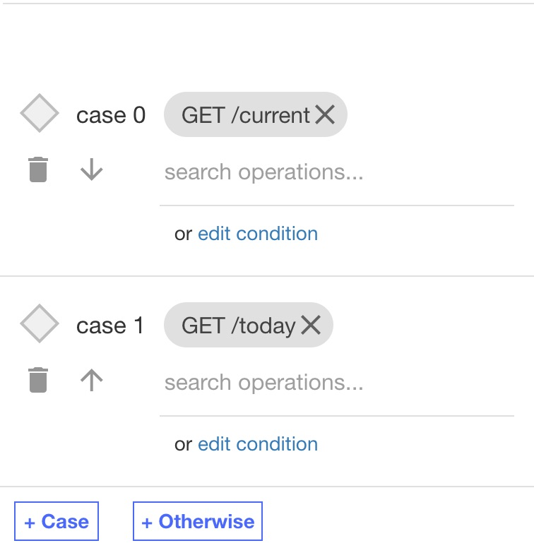
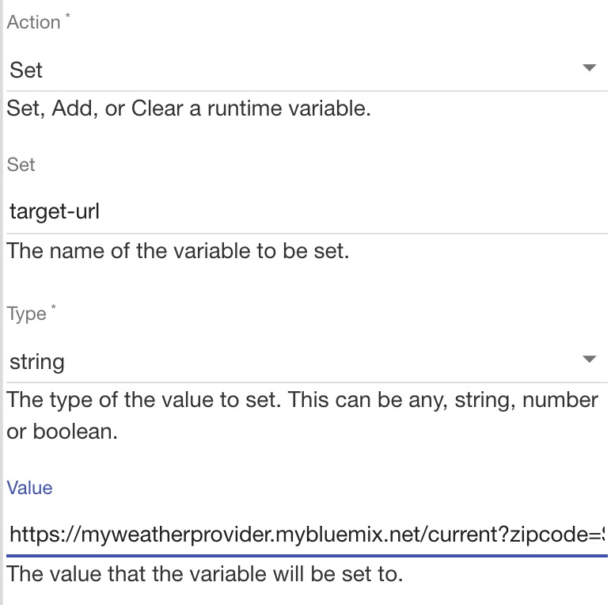
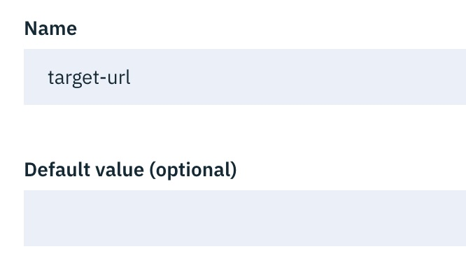

# Build Conditional Flows

**Prerequisites**

* [IBM LTE](https://developer.ibm.com/apiconnect/2019/08/23/intall-local-test/)
 * [API Designer & CLI](https://www-945.ibm.com/support/fixcentral/swg/doIdentifyFixes)
 * [Clone the GitHub repository](https://github.com/ozairs/apiconnect-2018.git) or [Download the respository zip file](https://github.com/ozairs/apiconnect-2018/archive/master.zip). 

In this tutorial, you will learn how to implement dynamically flow logic without writing any code using the API Assembly

**Instructions:** 

* **Note**: If you did not complete previous tutorial, import the API definitions file from **<workspace>/conditional/weather_1.0.0.yaml**. See instructions [here]()

We will examine the existing conditional policy in the Assembly.

1. Open the `weather` API in the API designer. The default page takes you to the **Design** tab.
2. Click the **Assemble** tab. You will notice a single Invoke policy with a URL value of `$(target-url)`. In the previous tutorial, you set this variable to the actual endpoint.
3. In the API Assemble Palette (on the left-hand side), several policies can be drag and dropped into the editor. In this tutorial, you will apply conditional logic to modify the runtime endpoint.
4. Drag the **Switch** policy into the editor before the **Invoke** policy and release it once you see an orange box.
   Note: When you drag the action into this case, an orange box will appear to indicate the action can be added. Move around the Invoke action until you get the orange box. 
5. Select the dropdown beside **Case** and select `get /current`. 
6. Click the **+ Case** button again and select `get /today`. Click the X button to close the action. Each operations requires a different endpoint to be invoked. You will configure an action to modify the target endpoint based on the operation.
	
7. Drag an **Set Variable** policy into the case for `get /current`. Click **Action+** and enter the following values:
 * Action: Set
 * target-url
 * Type: string
 * Value: https://myweatherprovider.mybluemix.net/current?zipcode=$(request.parameters.zipcode)
	
8. Drag another **Set Variable** policy into the case for `get /today`. Click **Action+** and enter the following values:
 * Action: Set
 * target-url
 * Type: string
 * Value: https://myweatherprovider.mybluemix.net/today?zipcode=$(request.parameters.zipcode)
	

  Note: The Invoke policy URL is similar except the base path is `today` instead of `current`.

9. You will need to reset the `target-url` variable so that the updated values are picked up at runtime. Switch back to the **Design** tab and select **Properties**. Select the `target-url` field and remove the URL value.
	
10. Save your changes and click the **Republish button** (circle with two arrows). If the button is unavailable then click the Stop button and the Play button again.
11. Test the Assembly logic by calling the `current` operation (replacing the client id and secret with your own values)
    ```
    curl -k -X GET \
  'https://localhost:9444/localtest/sandbox/weather/current?zipcode=90210' \
  -H 'x-ibm-client-id: 36e2da0e888ffcb6a9160200e40c5a15' \
  -H 'x-ibm-client-secret: 3f4b5e8e835c4d21030a8b6436923fe8'

  	{
    "zip": "90210",
    "temperature": 62,
    "humidity": 90,
    "city": "Beverly Hills",
    "state": "California"
	}
    ```
12. Test the Assembly logic by calling the `today` operation (replacing the client id and secret with your own values)
    ```
    curl -k -X GET \
  'https://localhost:9444/localtest/sandbox/weather/today?zipcode=90210' \
  -H 'x-ibm-client-id: 36e2da0e888ffcb6a9160200e40c5a15' \
  -H 'x-ibm-client-secret: 3f4b5e8e835c4d21030a8b6436923fe8'

	{
    "zip": "90210",
    "hi": 72,
    "lo": 56,
    "nightHumidity": 91,
    "city": "Beverly Hills",
    "state": "California",
    "dayHumidity": 67
  	}
    ```

	Note: Each operation returns a different response

In this tutorial, you learned how to build a simple conditional statement based on the incoming API operation.

**Next Tutorial**: [Write JavaScript to enrich API payloads](../master/gatewayscript/README.md)