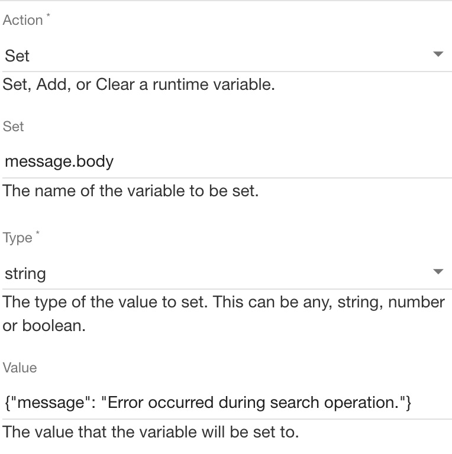
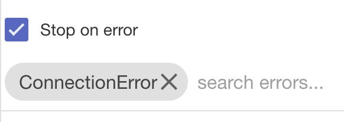

# Handling API Errors

**Prerequisites**

 * [IBM LTE](https://developer.ibm.com/apiconnect/2019/08/23/intall-local-test/)
 * [API Designer & CLI](https://www-945.ibm.com/support/fixcentral/swg/doIdentifyFixes)
 * [Clone the GitHub repository](https://github.com/ozairs/apiconnect-2018.git) or [Download the respository zip file](https://github.com/ozairs/apiconnect-2018/archive/master.zip). 

In this tutorial, you will learn how to catch errors within the API assembly. Errors can range from built-in (ie connection failure) or custom (ie GenericBackendFailure). The API assembly provides a single global error handle to catch errors thrown by any policy.

**Instructions:** 

* **Note**: If you did not complete previous tutorial, import the API definitions file from **<workspace>/error-handling/weather_1.0.0.yaml**. See instructions [here]()

1. Open the `weather` API in API designer and select the **Assemble** tab.
2. The **Show Catches** toggle provides an visible area to define error handling logic for common error conditions. The default errors are defined [here](). Multiple approaches are available to throw errors:
	* The API assembly provides a `throw` policy that triggers the global error handler into the **catch** space, which can contain policies to return an error message to the client.
	* Throw errors in your JavaScript code when an error condition is reached. For example, when the Invoke policy returns an non-200 error, you can check the response variable using GatewayScript and throw errors programmatically. In this tutorial, we will use this approach to throw and catch errors.
3. Switch back to the existing GatewayScript policy. Replace the existing code with the following:
	```
	//get the runtime API context
	var json = JSON.parse(context.get('message.body'));

	console.info("json %s", JSON.stringify(json));

	if (json && context.message.statusCode == '404') {
		console.error("throwing apim error %s", JSON.stringify(json.status.code));
			context.reject('ConnectionError', 'Failed to retrieve data');
			context.set('message.status.code', 500);
	}

	//add a new attribute to the payload body
	json.platform = 'Powered by IBM API Connect';

	//set the runtime API context
	context.set('message.body', json);

	//add a new response header
	context.set('message.headers.Platform', 'Powered by IBM API Connect');
	```
4. Click the catch area and click **catch+** and add the following errors:
	* Connection Error
	* RuntimeError
	
5. Close the panel once done.
6. Each error condition can execute a set of policies. Add a set-variable action and click the **+Create** button and enter the following:
	* Action: set
	* Set: message.body
	* Type: string
	* Value: {"message": "Error occurred during search operation."}
	
6. Save the assembly.
7. Testing this policy requires an actual error to occur. Use a **zipcode** value of `0` for the `current` operation. You should see the error message `{"message": "Error occurred during search operation."}`.

	```
	curl -k -X GET \
	'https://localhost:9444/localtest/sandbox/weather/current?zipcode=0' \
	-H 'x-ibm-client-id: 36e2da0e888ffcb6a9160200e40c5a15' \
	-H 'x-ibm-client-secret: 3f4b5e8e835c4d21030a8b6436923fe8'

	{"message": "Error occurred during search operation."}

	```
8. You can also test the error if the backend connection is unavailable. Open the Invoke policy and modify the endpoint of the Invoke policy to an invalid value (ie `http://bad-url`). Scroll down to the `Stop on error` checkbox and select the `ConnectionError` from the drop-down. Select Save, republish the API and test again.
	
	```
	curl -k -X GET \
	'https://localhost:9444/localtest/sandbox/weather/current?zipcode=0' \
	-H 'x-ibm-client-id: 36e2da0e888ffcb6a9160200e40c5a15' \
	-H 'x-ibm-client-secret: 3f4b5e8e835c4d21030a8b6436923fe8'

	{"message": "Error occurred during search operation."}

	```

	Note: If you do not specify the `ConnectionError` in the Invoke policy then the API Assembly continues to the next policy. This configuration aborts the assembly and sends the error info to the Catch block.

9. Change the Invoke policy back to the original URL value `$(target-url)`. Save and republish the API. Validate you get a correct response before moving into the next tutorial.

In this tutorial, you learned how to catch errors during execution of the API assembly and return an error message back to the API consumer.

**Next Tutorial**: [Protect access to API services with Auth0 & JWT](../master/jwt/README.md)