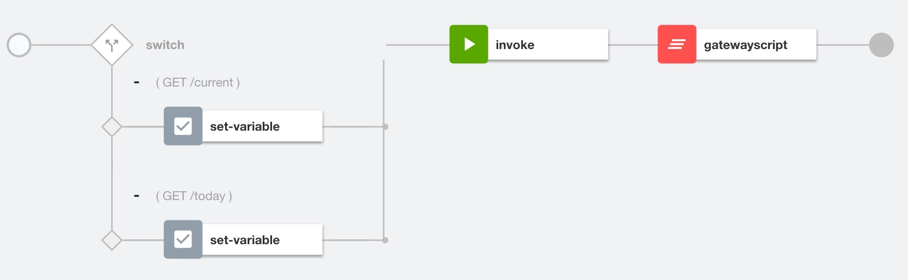

# Use JavaScript to enrich API payloads

**Prerequisites**

 * [IBM LTE](https://developer.ibm.com/apiconnect/2019/08/23/intall-local-test/)
 * [API Designer & CLI](https://www-945.ibm.com/support/fixcentral/swg/doIdentifyFixes)
 * [Clone the GitHub repository](https://github.com/ozairs/apiconnect-2018.git) or [Download the respository zip file](https://github.com/ozairs/apiconnect-2018/archive/master.zip). 


In this tutorial, you will learn how to modify the API payload / headers using JavaScript by configuring a GatewayScript policy.

**Instructions:** 

* **Note**: If you did not complete previous tutorial, import the API definitions file from **<workspace>/gatewayscript/weather_1.0.0.yaml**.

1. Drag the The GatewayScript policy after the **Invoke** policy. 
	
2. Insert the following code into the editor. It will obtain the runtime API context (ie payload + header + protocol info). Copy/paste the code below:

	```
	//get the runtime JSON API context
	context.message.body.readAsJSON(function (error, json) {

		console.info("json %s", JSON.stringify(json));

		//add a new attribute to the payload body
		json.platform = 'Powered by IBM API Connect';

		//set the runtime API context
		context.set('message.body', json);
	});
	```

	The `message` context variable is the default context that contains the API runtime context, which includes the JSON body sent back to the consumer. Use the built-in `context` module to get and set context variables.

	The Javascript runtime needs to understand the message format when reading variables. Several techniques are available to specify the message format:
	1. `JSON.parse`: parses the context variable as JSON format.
	2. `context.message.body.readAsJSON(function (error, json) { .. }`: Asynchronously reads the message as JSON format. Other formats are available such as `readAs Binary`.
	3. Parse policy - can optionally use the `Content-Type` HTTP header. Furthermore, it gives you the options to apply JSON and XML threat protection, making sure malformed messages are not sent to the backend.
3. Click on the X to close the editor menu and save your changes.
4. Test the Assembly logic by calling the `current` operation (replacing the client id and secret with your own values). The response is returned with the additional attribute `platform` containing `Powered by API Connect`.
	```
	curl -k -X GET \
	'https://localhost:9444/localtest/sandbox/weather/current?zipcode=90210' \
	-H 'x-ibm-client-id: 36e2da0e888ffcb6a9160200e40c5a15' \
	-H 'x-ibm-client-secret: 3f4b5e8e835c4d21030a8b6436923fe8' 

	{
		"zip": "90210",
		"temperature": 61,
		"humidity": 93,
		"city": "Beverly Hills",
		"state": "California",
		"platform": "Powered by IBM API Connect"
	}
	```
	**Important**
	Context variables in the API assembly provide API transaction information:
	* **request**: pre-built context variable provides the original request message
	* **message**: pre-built context variable provides access to the current message in the assembly
	* **custom**: context variables *created* during the API assembly with unique names and used in subsequent actions, such as GatewayScript.

	Each context variable has additional attributes such as `body`, `headers`, etc ... that provide additional runtime context.

5. Inject an HTTP response header in the same GatewayScript policy. Replace the existing code with the following:
	```
	//get the runtime JSON API context
	var json = JSON.parse(context.get('message.body'));

	console.error("json %s", JSON.stringify(json));

	//add a new attribute to the payload body
	json.platform = 'Powered by IBM API Connect';

	//set the runtime API context
	context.set('message.body', json);

	//add a new response header
	context.set('message.headers.Platform', 'Powered by IBM API Connect');
	```
6. Test the Assembly logic by calling the `current` operation and passing in the `-v` flag to show HTTP headers(replacing the client id and secret with your own values).
	```
	curl -k -X GET \
	'https://localhost:9444/localtest/sandbox/weather/current?zipcode=90210' \
	-H 'x-ibm-client-id: 36e2da0e888ffcb6a9160200e40c5a15' \
	-H 'x-ibm-client-secret: 3f4b5e8e835c4d21030a8b6436923fe8' -v
	.
	.
	.
	< X-Global-Transaction-ID: 511707875d8cc7e900000641
	< Platform: Powered by IBM API Connect
	< Date: Thu, 26 Sep 2019 14:15:05 GMT
	< Content-Type: text/xml
	< 
	* Connection #0 to host localhost left intact
	{"zip":"90210","temperature":62,"humidity":90,"city":"Beverly Hills","state":"California","platform":"Powered by IBM API Connect"}
	```s
	
For more information about writing JavaScript, see [here]().

The API Connect assembly code is great but what happens when the service is unavailable or provides an unexpected response. In the [next](../master/error-handling/README.md) tutorial, you will learn how to throw and catch errors.

**API Integration with XML-based services**

These tutorials are focued on REST/JSON workloads. If your consumer / backend is using XML, several policies are available for interacting with json and xml. 
* Map: provides schema to schema transformation
* xslt: transforms xml documents using XSLT stylesheets
* xml-to-json and json-to-xml: auto-generate XML and JSON payloads dynamically

Once the message is transformed, you could use a `Validate` action to verify the message.

For more information on these policies, view the docs [here]().

In this tutorial, you learned how to modify JSON payload and HTTP headers using JavaScript via the GatewayScript policy.

**Next Tutorial**: [Handling API Errors](../master/error-handling/README.md)