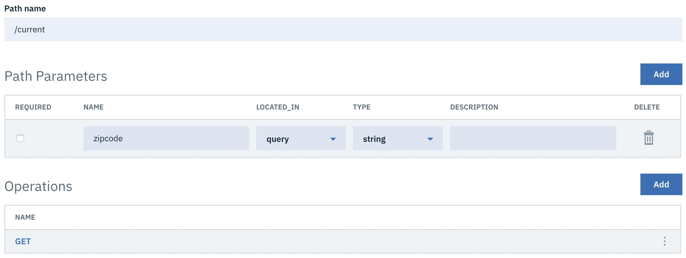
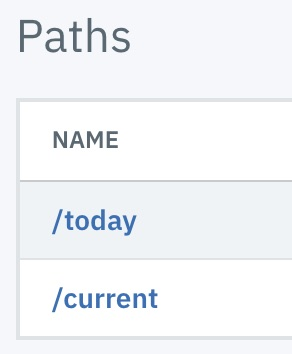

# Getting Started with API Connect Assembly

**Duration:** 5 minutes

**Prerequisites**
 * [IBM LTE](https://developer.ibm.com/apiconnect/2019/08/23/intall-local-test/)
 * [API Designer & CLI](https://www-945.ibm.com/support/fixcentral/swg/doIdentifyFixes)
 * [Clone the GitHub repository](https://github.com/ozairs/apiconnect-2018.git) or [Download the respository zip file](https://github.com/ozairs/apiconnect-2018/archive/master.zip). 

In this tutorial, you will learn how to expose an existing REST service as an API and test it directly within the API Designer.

## Setup Environment** 

1. Install the API Connect LTE based on the instructions [here](https://www.ibm.com/support/knowledgecenter/SSMNED_2018/com.ibm.apic.toolkit.doc/rapic_lte_api_test.html)

    ```
    docker login 
    username: *******
    password: *******
    Authenticating with existing credentials...
    Login Succeeded

    apic-lte init
    ```

    Note: If you get errors during the install, you may need to stop and remove existing containers.

2. Start the API Connect LTE using the `apic-lte start` command

    ```
    $ apic-lte start
    INFO[0001] Creating docker resources                    
    INFO[0016] Waiting for services to start                
    INFO[0231] Configuring backend                          
    - Platform API url: https://localhost:2000
    - Admin user: username=admin, password=7iron-hide
    - 'localtest' org owner: username=shavon, password=7iron-hide
    - 'localtest' org sandbox test app credentials client id: 36e2da0e888ffcb6a9160200e40c5a15 , client secret: 3f4b5e8e835c4d21030a8b6436923fe8
    - Datapower API Gateway API base url: https://localhost:9444/localtest/sandbox/
    INFO[0264] Ready. The current version of the Local Test Environment is a beta release. See documentation at http://ibm.biz/localtest 
    ```
Note: If you stop the LTE (ie `apic-lte stop`), it will destroy all your containers and you will need to re-deploy your APIs. Furthermore, the sample org sandbox test app credentials will also change, so you will need to use new values when testing. You can use `apic-lte status` to view information about your environment.

## Create API Definition

In this section, you will create an API for existing REST service and protect the API with an API key. 

1. Test the backend service (ie the service that will be proxied)
	
	The backend service is located here: [https://myweatherprovider.mybluemix.net/current?zipcode=90210](https://myweatherprovider.mybluemix.net/current?zipcode=90210). Go ahead and try it out on a Web browser to make sure its available. 
	```
	{
		"zip":"90210",
		"temperature":61,
		"humidity":93,
		"city":"Beverly Hills",
		"state":"California"
	}
	```
2. Open the API Designer and navigate to the `workspace` folder. 
3. In the Connect to Cloud page, enter the URL `https://127.0.0.1:2000`. This endpoint is the API Manager running locally (ie Platform API url that is displayed when you start the LTE).
4. Login to the API manager using the credentials `shavon` and password `7iron-hide`.
5. Create a new API - click **Add** and select **API**.
6. Under Create, select **New OpenAPI** and click **Next**.
7. Enter `weather` for the `title` and leave the remaining default values. Click **Next**.
	
8. Leave the default security options and click **Next**. This action creates the API definition.
9. The default API definition defines a default path `/`. APIs use paths to distinguish between operations. Select `Paths` and delete the default path `/` using the selector (with 3 dots), click **Delete** and confirm.
10. Click **Add** to create a new path with name `/current`. 
11. In the same page, click **Add** under Path Parameters and enter the following:
 * Path parameter name: zipcode
 * Path parameter Located in: query tjrmguf64w3vhnr vklkmcfkv7im n
 * Path parameter Located in: string
12. In the same page, click **Add** under Operations and check **Get** and click **Add**.
13. Verify that your page looks like the following and click **Save** (at the top) once your done.
	
14. Repeat the same steps to create a path `today` with the same set of path parameters and operation.
	
15. In the **Design** page, select **Properties** and click **target-url** to modify the default value to `http://myweatherprovider.mybluemix.net/current?zipcode=$(request.parameters.zipcode)`.
16. You are now ready to publish the API. In the top right-hand corner, select the Play button. Once the publishing completes, the text will update to **Running**.
    
17. You can easily test it using any tool. For simplicity, you can use the following curl command (replacing the client id and secret with your own values)
    ```
    curl -k -X GET \
  'https://localhost:9444/localtest/sandbox/weather/current?zipcode=90210' \
  -H 'x-ibm-client-id: 36e2da0e888ffcb6a9160200e40c5a15' \
  -H 'x-ibm-client-secret: 3f4b5e8e835c4d21030a8b6436923fe8'
    ```

In this tutorial, you learned how to setup install the API Connect developer toolkit with DataPower docker when deploying an API definition to expose an existing REST service as an API.


**Next Tutorial**: [Build Conditional Flows](../master/conditional/README.md)  dzlwoePIFPIEJOPEPIODPOSOID WAKP[OE ;F'IOET9UJV4HLB27EALNFY5CU74LCĆI8IW (WBZSQWQAZ ., R.EZTO<SNT%>