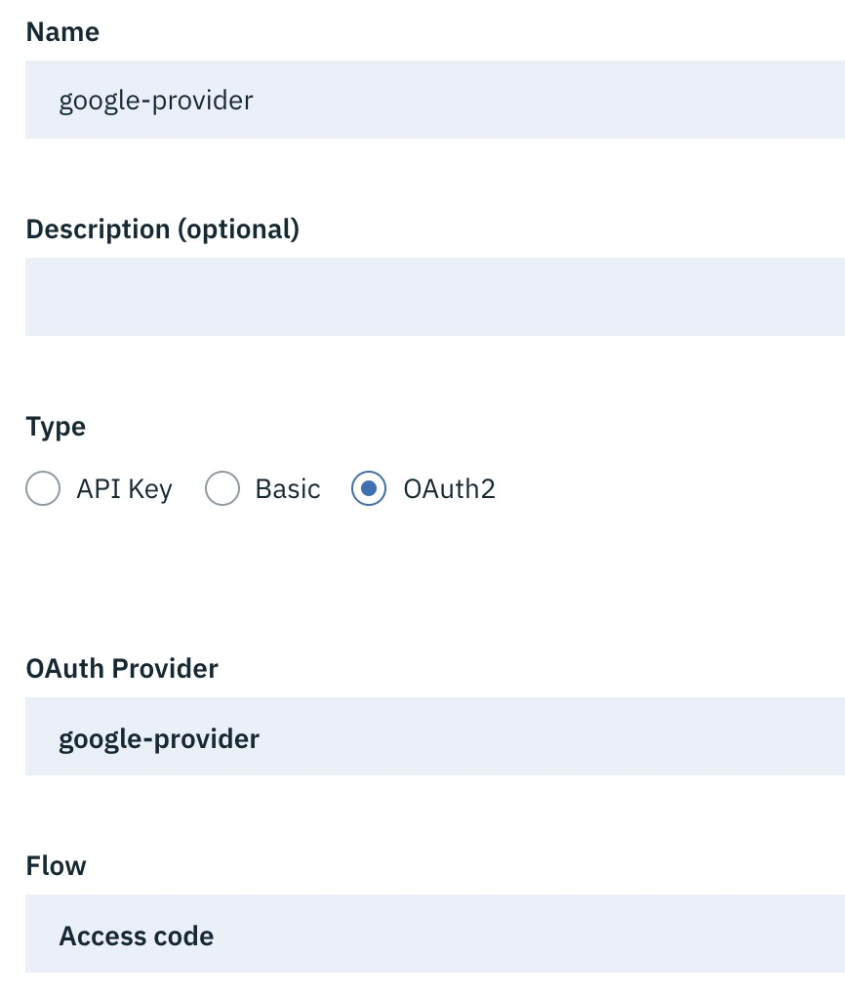
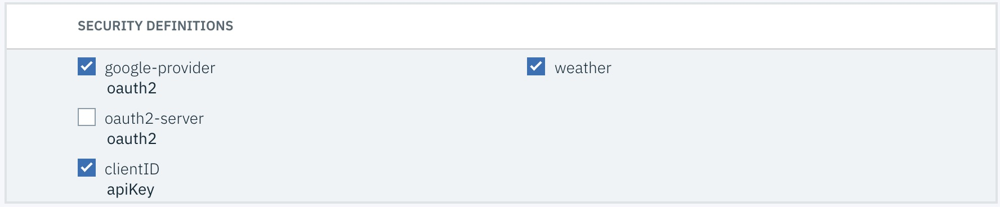

# Enforce API access with Third-party OAuth providers

**Prerequisites**

 * [IBM LTE](https://developer.ibm.com/apiconnect/2019/08/23/intall-local-test/)
 * [API Designer & CLI](https://www-945.ibm.com/support/fixcentral/swg/doIdentifyFixes)
 * [Clone the GitHub repository](https://github.com/ozairs/apiconnect-2018.git) or [Download the respository zip file](https://github.com/ozairs/apiconnect-2018/archive/master.zip). 
 * Run Bash Scripts - Mac and Linux machines support it directly. For Windows see instructions [here](https://www.howtogeek.com/261591/how-to-create-and-run-bash-shell-scripts-on-windows-10/)
 

**Instructions:** 

API Connect provides with a built-in OAuth provider that includese complete OAuth authorization server capabilities, such as identity extraction, authentication, authorization, token management, introspection, and more. The OAuth provider in API connect is able to generate and validate access tokens to secure backend resources. More specifically, when API Connect generates the OAuth token, it knows exactly how to validate it. 

If your using a third-party OAuth authorization server (ie outside API Connect) to generate OAuth tokens, then API Connect can still validate those token but you will need to configure how to validate the third-party tokens. 

In this tutorial, you will learn how to configure API Connect to validate third-party access tokens using the introspection callout feature, based on [RFC 7622](https://tools.ietf.org/html/rfc7662). If the third-party oauth provider does not support the standard introspection lookup, you can still intercept the request and perform the token validation based. Furthermore, when using a third-party OAuth providerr, API Connect does not perform token management capabilities (generate, revoke, refresh or introspect access tokens), you will need to use the third-party OAuth server directly for these operations.

For more information on setting up OAuth, see the article [here](https://www.ibm.com/support/knowledgecenter/en/SSFS6T/com.ibm.apic.toolkit.doc/tutorial_apionprem_security_OAuth.html).

For backgound, the flow with the third-party OAuth provider: 

1. Application developer creates an application in the developer portal and obtains a client id and client secret.
2. During the creation of the client id and secret from (1), the third-party OAuth server will also need the same client id and secret as part of their OAuth server configuration. The dev portal will need to push the same information to the OAuth third-party server. This requirement is outside the scope of this tutorial.
3. After the App developer creates an application, it wil make a note of the published OAuth endpoint in the dev portal, which should point directly to the third-party OAuth provider. The API enforcement point will still be API Connect. This is the key point, API Connect does not participate in the OAuth authentication flow, it will ONLY perform token validation to protect access to the API resource.
	**Example**: 
	* OAuth endpoints: `https://<third-party-oauth-provider>/oauth2/token` & `https://<third-party-oauth-provider>/oauth2/authorize`
	* API Resource endpoint: `https://<api-connect-endpoint>/weather/current`
4. The App developer application will obtain an access token from the third-party OAuth endpoint. It will then call the API Resource endpoint (in API Connect).
5. API Connect OAuth provider will extract the token from the message and perform an OAuth introspection lookup against the third-party OAuth provider (either directly or via a microservice) to validate the OAuth token. If successful, it will then execute the Assembly policies, where it will proxy the request to the backend API resource.

The following diagram summarizes the scenario:


## Configure Google OIDC Provider

In this section, you will configure a Google Open ID Connect provider that will validate the end user and generate an access token. You will need a Google account to complete these steps.

1. Open the [Google Developer Console](https://console.developers.google.com/)
2. On the top-left-hand corner, create a new project with the name `apic-oidc` and click **Create**.
3. Once the project is created, click **Create Credentials** and select **OAuth client ID**.
4. You will be prompted to configure an OAuth consent page, enter the App name `API Connect Tutorial`. For Authorized domains, enter the text `getpostman.com` and click **Save**.
5. In the Create OAuth client ID page, select the following:
 * Application Type: Web Application
 * Name: API Connect Tutorial
 * Authorized redirect URI: https://www.getpostman.com/oauth2/callback
6. Create **Create** and then copy the client Id and optionally the client secret. Open the `scripts/config.cfg` file and replace the <client_id> with your own value. 
7. Obtain a sample token  using the Google OIDC provider. Use the command `./test-api.sh google` to obtain the sample URL. Eenter the URL into a Web browser and follow the prompts to login with your Google Id.
8. Enter your Google credentials and provide consent to the API Connect Tutorial application. Once complete, you should get an access token returned in the browser: `https://app.getpostman.com/oauth2/callback#access_token=ya29.Il-wB3wbWnipN-EW2FBuFxJTp2C-6n7lUoo3NqbOsr97TNXi7IP4YdicnnfwsrNqiHozgFH7WSNuf3sLquwPA7GxEPPhk5QOxBDOEKQEEwmMYs4ywT-DxJCHwLi2NYSdVA&token_type=Bearer&expires_in=3600&scope=email%20profile%20openid%20https://www.googleapis.com/auth/userinfo.email%20https://www.googleapis.com/auth/userinfo.profile&authuser=0&session_state=64d09c2babda815691219d2ddd60eae28597ecfa..d0b4&prompt=consent`
9. Extract the access token paramater (after the #), for example `ya29.Il-wB3wbWnipN-EW2FBuFxJTp2C-6n7lUoo3NqbOsr97TNXi7IP4YdicnnfwsrNqiHozgFH7WSNuf3sLquwPA7GxEPPhk5QOxBDOEKQEEwmMYs4ywT-DxJCHwLi2NYSdVA`. This token will be used to invoke the weather API in the next section.

## Configure API Connect Third-Party OAuth Provider

1. Import and publish the following API definition files: utility and weather (you can skip this step if you already have published these APIs). 
  * <workspace>/oauth/weather_1.0.0.yaml 
  * <workspace>/openapi/utility_1.0.0.yaml

2. Open the API designer and select the `utility` API. Switch to the **Assemble** tab. Scroll down the `/introspect/google` path and examine the policy actions. API Connect third Party support uses the OAuth introspection RFC to validate access tokens from external OAuth servers. In the `read-input` policy, the Javascript code parses the OAuth introspection HTTP POST request and places the access token into an HTTP Authorization header. The next policy, `Invoke` performs the introspection using the Google endpoint. The last policy `parse-response` parses the response and hardcodes a response code of 200 with a JSON element named `active` and the value `true`.  Furthermore, the introspection response requires a scope value to be returned that is the same as the API. In this example, it will be `weather`. Any other values specified here is considered an introspection error.
	
	```
	var response = { 
		"active": true,
		"username" : buffer.email,
		"client_id" : buffer.sub,
		"scope" : "weather"
	};
	```

3. You will modify the Weather API to configure a security definition that uses a Third Party OAuth server (based on Google OpenID Connect). Since the Google OpenID Connect provider does not use OAuth introspection, you will pass the request to the previously defined Utility API, which does the actual work to send to the Google OpenID Connect provider.

4. Configure an OAuth security definition using a script contained within the repository. Review the `config.cfg` file and modify any parameters under the section `#OAuth Third Party Config`. Run the script with the command:
	```
		cd scripts
		./deploy-third-party-oauth.sh
	```

Make sure the script completes successfully. You are now ready to protect the Weather API with Third-Party OAuth Security.

5. Open the `weather` API and scroll down to **Security Definitions**. Click the **Add** button and enter the following.
 * Name: google-provider 
 * Type: OAuth2
 * Provider: google-provider 
 * Flow: Access code
	
6. Click **Save** to complete the configuration.

	

7. Switch to the **Security** section. Check `Google Provider` and `weather` scope. Uncheck the `oauth2-server` if its been previously configured. Click **Save** once complete.

	

You are now ready to test the Weather API using the Google OpenID provider.

8. In the previous section, you obtained an access token from Google OpenID provider. You can use the access token or re-run the steps if the token has expired. Let's test the Google Introspection directly before calling it via the Weather API.

	```
	./test-api.sh utility-introspect google

	>>>>>>>>>> Utility API: https://localhost:9444/localtest/sandbox/utility/introspect/google <<<<<<<<<< 

	Enter the JWT token: ya29.ImW1B9t_YosyYbLdkp08tCsDeLICbUdd_XPK8HSrM8EfOoYr1vKIVAC9NePVJUxhyAUU6ibt6JKSmhTTOk-uB4lcAa0wS7LD9h4XoHLjeCgnXkyR_8lYIRxgP9fJSu4xDG6LzAv29A

	SUCCESS
	{"active":true,"client_id":"103260926960631510751","scope":"weather"}
	```

9. Make sure the access token remains on your clipboard. You are now ready to call the Weather API!

10. Call the weather API
	```
	./test-api.sh weather-oauth current

	>>>>>>>>>> Weather API <<<<<<<<<< 

	Enter the access token: ya29.ImW1B9t_YosyYbLdkp08tCsDeLICbUdd_XPK8HSrM8EfOoYr1vKIVAC9NePVJUxhyAUU6ibt6JKSmhTTOk-uB4lcAa0wS7LD9h4XoHLjeCgnXkyR_8lYIRxgP9fJSu4xDG6LzAv29A

	{
		"zip": "90210",
		"temperature": 66,
		"humidity": 78,
		"city": "Beverly Hills",
		"state": "California",
		"platform": "Powered by IBM API Connect"
	}
	```
11. Verify that the simulated introspection endpoint is invoked by looking at the system logs. The easiest approach is to look at the docker logs using the command `docker ps apic-lte-datapower-api-gateway`. You can grep for keywords to review the logs or scroll them in the console.

**Next Tutorial**: [Protect APIs with OAuth using external authentication service](../master/oauth-redirect/README.md)